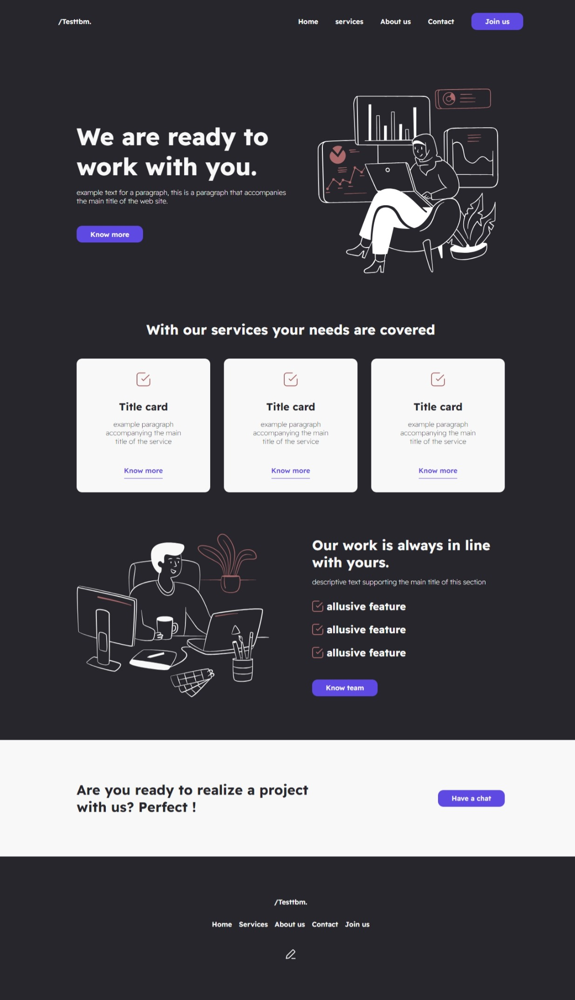
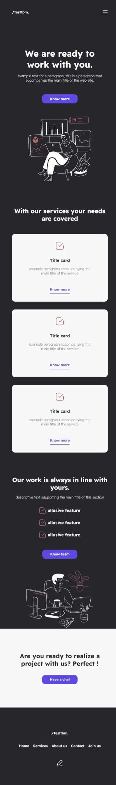

# Maquetado de landing page

### Descripción:
Este proyecto es una práctica que refuerza conocimientos sobre la combinación de colores en el diseño de interfaces web con figma, maquetación web con html, css y diseño web responsive.

**Vista previa del proyecto:**

**Tamaño Desktop:**

**Visualización en tamaño Movil:**

### Recursos

* Fuente en [Google Fonts](https://fonts.google.com/)
* Diseño en [Figma](https://www.figma.com/)
* Paleta de colores en [coolors](https://coolors.co/27262c-f8f8f8-ad6a6c-5e4ae3)